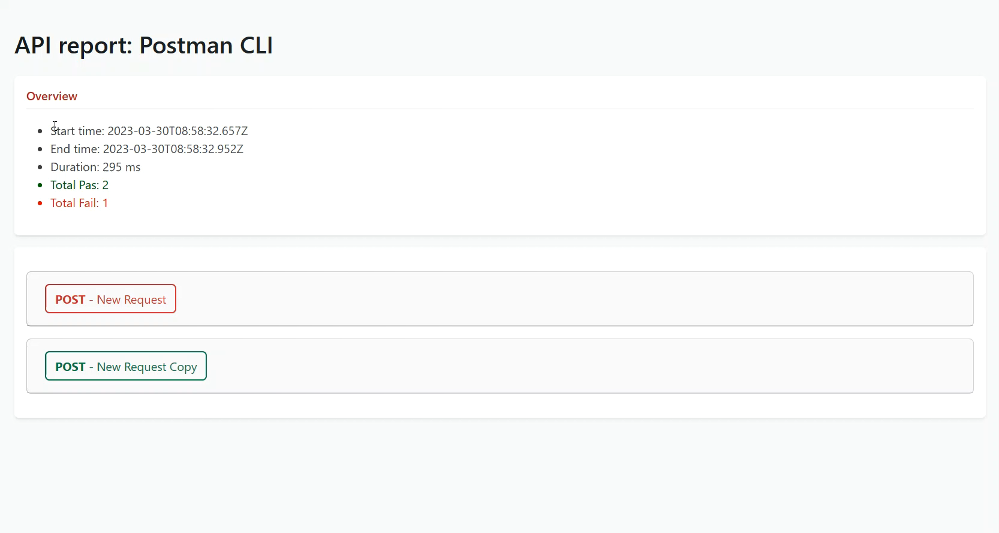
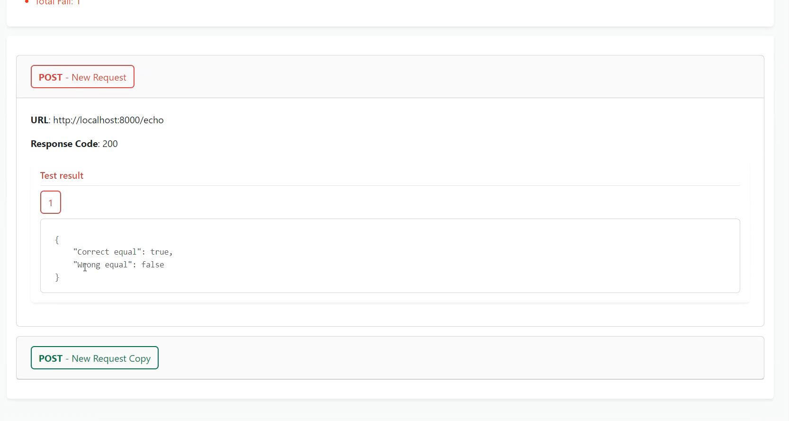
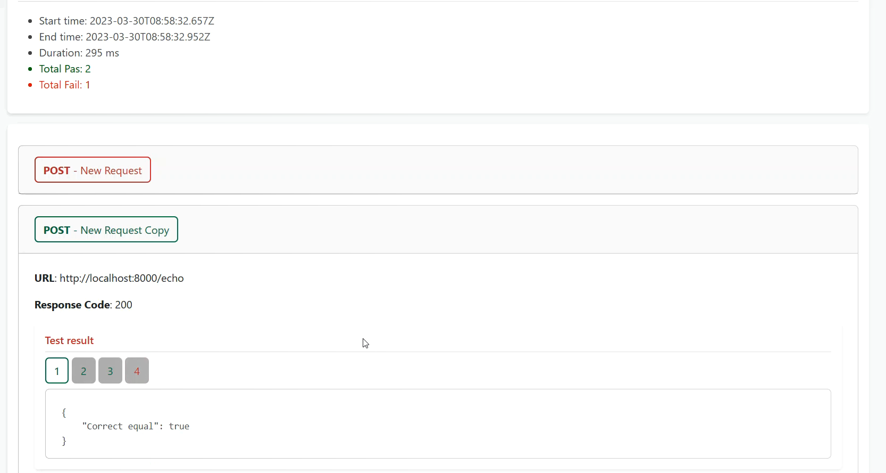

# How to run

## Setup
- Setup Nodejs in machine first
- Open CMD or powershell

```bash
cd .\postman-report-html
npm i
```

## Example

- Full argument: input + output
```bash
node app.js -i='C:\Users\dunguyen\VScodeProject\postman-report-html\data\sample.postman_test_run.json' -o='C:\Users\dunguyen\Desktop\report.html'
```

- Only input argument, the report will be in user's folder e.g `C:\Users\lucas\postman-report-29-03-2023_21-43-52.html`

```bash
node app.js -i='C:\Users\dunguyen\VScodeProject\postman-report-html\data\sample.postman_test_run.json'
```



